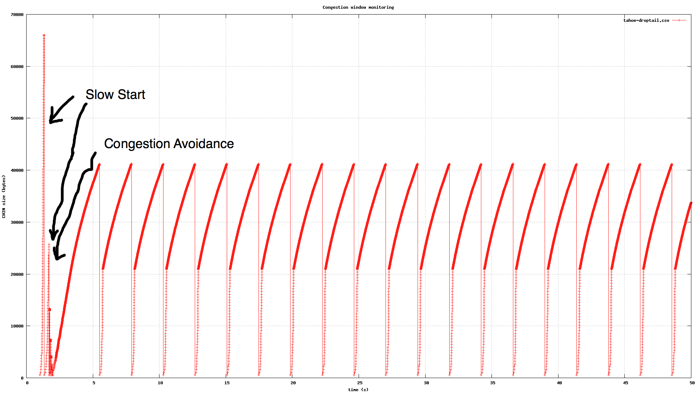
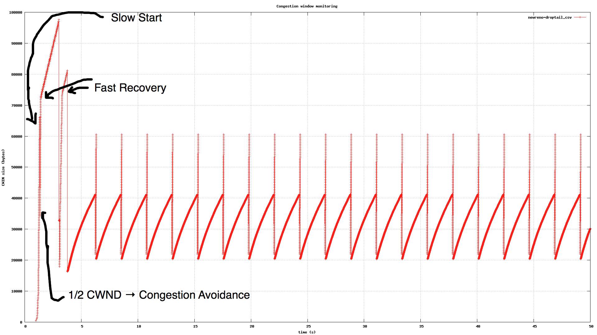

Lab 1: TCP Performance Monitoring
=================================

*Note: this file is written in Markdown. For more comfortable reading please see my [GitHub page](https://github.com/michielappelman/an).*

Installation tutorial
---------------------

Following the ns-3 installation tutorial:

    $ wget https://www.nsnam.org/release/ns-allinone-3.16.tar.bz2
    $ bunzip2 ns-allinone-3.16.tar.bz2 
	$ tar xf ns-allinone-3.16.tar 
	$ cd ns-allinone-3.16/
	$ vi README 
	$ ./build.py --enable-examples --enable-tests
	'build' finished successfully (1.133s)

	Modules built:
	antenna                   aodv                      applications             
	bridge                    buildings                 config-store             
	core                      csma                      csma-layout              
	dsdv                      dsr                       emu                      
	energy                    flow-monitor              internet                 
	lte                       mesh                      mobility                 
	mpi                       netanim (no Python)       network                  
	nix-vector-routing        olsr                      point-to-point           
	point-to-point-layout     propagation               spectrum                 
	stats                     tap-bridge                test (no Python)         
	tools                     topology-read             uan                      
	virtual-net-device        wifi                      wimax                    

	Modules not built (see ns-3 tutorial for explanation):
	brite                     click                     openflow                 
	visualizer
	$ cd ns-3.16/
	$ ./test.py -c core
	$ ...
	145 of 148 tests passed (145 passed, 3 skipped, 0 failed, 0 crashed, 0 valgrind errors)
	$ ./waf --run hello-simulator
	Waf: Entering directory `/home/mike/ns-allinone-3.16/ns-3.16/build'
	Waf: Leaving directory `/home/mike/ns-allinone-3.16/ns-3.16/build'
	'build' finished successfully (2.794s)
	Hello Simulator

Apparently it works!

**Study how to:**

create nodes

    NodeContainer nodes;
    nodes.Create (2);

setup network topology

    PointToPointHelper pointToPoint;
    pointToPoint.SetDeviceAttribute ("DataRate", StringValue ("5Mbps"));
    pointToPoint.SetChannelAttribute ("Delay", StringValue ("2ms"));
    
    NetDeviceContainer devices;
    devices = pointToPoint.Install (nodes);

assign IP addresses

    InternetStackHelper stack;
    stack.Install (nodes);
    
    Ipv4AddressHelper address;
    address.SetBase ("10.1.1.0", "255.255.255.0");
    
    Ipv4InterfaceContainer interfaces = address.Assign (devices);

install UDP applications.

    UdpEchoServerHelper echoServer (9);
    
    ApplicationContainer serverApps = echoServer.Install (nodes.Get (1));
    serverApps.Start (Seconds (1.0));
    serverApps.Stop (Seconds (10.0));
    
    UdpEchoClientHelper echoClient (interfaces.GetAddress (1), 9);
    echoClient.SetAttribute ("MaxPackets", UintegerValue (1));
    echoClient.SetAttribute ("Interval", TimeValue (Seconds (1.0)));
    echoClient.SetAttribute ("PacketSize", UintegerValue (1024));
    
    ApplicationContainer clientApps = echoClient.Install (nodes.Get (0));
    clientApps.Start (Seconds (2.0));
    clientApps.Stop (Seconds (10.0));

**Study how to create UDP application using OnOffHelper class:**

I couldn't find anything on this in the `$NS3 HOME/examples/udp- client-server/udp-client-server.cc` file. Cahn admitted that it was his mistake.

**Open `$NS3 HOME/examples/tcp/star.cc` to study how to use OnOffHelper class to create TCP application server and clients.**

    // Create on/off TCP socket
    OnOffHelper onOffHelper ("ns3::TcpSocketFactory", Address ());
    onOffHelper.SetAttribute ("OnTime", StringValue ("ns3::ConstantRandomVariable[Constant=1]"));
    onOffHelper.SetAttribute ("OffTime", StringValue ("ns3::ConstantRandomVariable[Constant=0]"));

    // Create container 'spokeApps'
    ApplicationContainer spokeApps;

    // For every spoke node ..
    for (uint32_t i = 0; i < star.SpokeCount (); ++i)
    {   
	  // set the Server IP and port ..
      AddressValue remoteAddress (InetSocketAddress (star.GetHubIpv4Address (i), port));
      // set the remote address for the TCP on/off socket ..
      onOffHelper.SetAttribute ("Remote", remoteAddress);
      // install the on/off helper for the node i in the container
      spokeApps.Add (onOffHelper.Install (star.GetSpokeNode (i)));
    }   
    // Start all the applications installed in the spokeApps container
    spokeApps.Start (Seconds (1.0));
    spokeApps.Stop (Seconds (10.0));

**Create TCP socket and monitor congestion window: in `$NS3 HOME/examples/tutorial/fifth.cc`**

I did look at the rest of the tutorial but only while I was hacking together the script below:

Task 1: Throughput of TCP
-------------------------

Please see the file attached named `[lab1-task1-appelman.cc](lab1-task1-appelman.cc)`. This is the output:

    mike@alpha:~/ns-allinone-3.16/ns-3.16$ ./waf --run "lab1"
    Flow 1, delay: 64ms (10.1.1.2 -> 10.1.1.1)
      Tx Bytes:   6133168
      Rx Bytes:   6131888
      Throughput: 0.935652 Mbps
    Flow 2, delay: 64ms (10.1.1.1 -> 10.1.1.2)
      Tx Bytes:   213680
      Rx Bytes:   213480
      Throughput: 0.0325745 Mbps
    mike@alpha:~/ns-allinone-3.16/ns-3.16$ ./waf --run "lab1 --delay=96ms"
    Flow 1, delay: 96ms (10.1.1.2 -> 10.1.1.1)
      Tx Bytes:   4157048
      Rx Bytes:   4142072
      Throughput: 0.63203 Mbps
    Flow 2, delay: 96ms (10.1.1.1 -> 10.1.1.2)
      Tx Bytes:   143880
      Rx Bytes:   143800
      Throughput: 0.0219421 Mbps
    mike@alpha:~/ns-allinone-3.16/ns-3.16$ ./waf --run "lab1 --delay=128ms"
    Flow 1, delay: 128ms (10.1.1.2 -> 10.1.1.1)
      Tx Bytes:   3104696
      Rx Bytes:   3094328
      Throughput: 0.472157 Mbps
    Flow 2, delay: 128ms (10.1.1.1 -> 10.1.1.2)
      Tx Bytes:   107520
      Rx Bytes:   107280
      Throughput: 0.0163696 Mbps

As you can see I added a command line argument called delay to set the delay for the link so I don't have to change the source all the time.

### Questions ###

1. Done. See above.
1. It does, this is because the propagation of the data takes longer and thus the amount of Mb's that can be sent per second goes down because the sender is waiting for the receiver to acknowlede the reception (which also takes longer to arrive).
1. According to the [Broadband Internet Speedtest](http://speedtest.raketforskning.com/tuning-tcp-window-size.html), there is a simple calculation to make: `receive window size = bandwidth * delay`. In this case the optimal receiving window should be: `3.35544e6 bit/sec * 0.064 = 214748 bits = 26844 bytes`. Running this in a test yields the following result as seen below.

Not a particular high number compared to the result of the default of 16384 bytes... But this might be caused by the TCP slow start function. Through some testing of my own it appears that the optimal RWND should be around 16550 bytes.

    mike@alpha:~/ns-allinone-3.16/ns-3.16$ ./waf --run "lab1 --rwnd=26844"
	Flow 1, delay: 64ms, RWND: 26844 (10.1.1.2 -> 10.1.1.1)
	  Tx Bytes:   4118200
	  Rx Bytes:   4118200
	  Throughput: 0.628387 Mbps
	Flow 2, delay: 64ms, RWND: 26844 (10.1.1.1 -> 10.1.1.2)
	  Tx Bytes:   143520
	  Rx Bytes:   143240
	  Throughput: 0.0218567 Mbps

Task 2A: Monitoring TCP congestion window
----------------------------------------

Please see the `[lab1-task1-appelman.cc](lab1-task2-appelman.cc)` source file.

### Questions ###

1. Record CWND in two simulation scenario. Use gnuplot to visualize the graphs.
1. Mark points of slow start and congestion avoidance in the graphs during time period 1s-3s for both scenarios: with and without droptail queue setting.
1. Perform similar experiment with droptail queue setting 40 packets for other TCP variants: Reno and New Reno. Plot graphs and show differences among them in phases: slow start, congestion avoidance and fast recovery.

For answers, see pictures below:

Tahoe w/o droptail:

Tahoe with droptail:

Reno w/o droptail:

Reno with droptail:

NewReno w/o droptail:

NewReno with droptail:

Task 2B: Connection sharing
----------------------------------------

We got this note from Canh which helped a lot:

> The Task 2B asks to change data rate at time 20.0s, meaning you need to schedule a function call at that time by using Simulator::Schedule() method. 
> 
> To make thing simple without involving to much in C++, here is the sample code using for Task-2B simulation:
> 
> `Simulator::Schedule(Seconds(20.), &MyApp::ChangeRate, clientApp, DataRate("10Mbps"));`
> 
> which:
>  - `&MyApp::ChangeRate` is the pointer to class method 
>  - `clientApp` is the MyApp class object
>  - `DataRate("10Mbps")` is the parameter for MyApp::ChangeRate method.

### Questions ###

1. Monitor CWND changes when UDP connection starts and competes bandwidth of the bot- tleneck. Use gnuplot to plot graphs.
1. Explain results.

