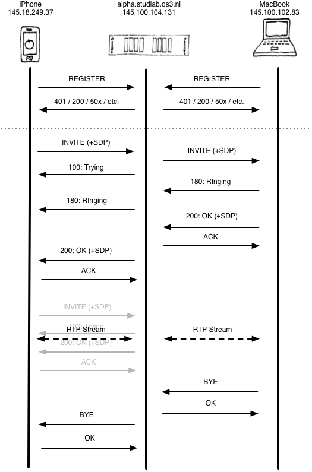

Lab 2: VoIP Protocols
=====================

Preparation
-----------

 1. I already had tcpdump installed but installed Wireshark as well.
 1. Asterisk server was installed by `apt-get`
 1. I will use the *Zoiper*  SIP client for my Mac and *Bria* for my iPhone.

Task 1: Asterisk Configuration
------------------------------

I first generated the MD5 hash for the users, thanks to [voip-info.org](http://www.voip-info.org/wiki/view/Asterisk+sip+md5secret):

    $ echo -n "appelman01:asterisk:an2013" | md5sum
    9bcc1b8aa11e2c44cc90de89f813d025  -
    $ echo -n "appelman02:asterisk:an2013" | md5sum
    23f134c77231e202ddd494448e9c471f  -

I could then add them to my `sip.conf` file:

	[appelman01]
	type=peer
	host=dynamic
	md5secret=9bcc1b8aa11e2c44cc90de89f813d025
	context=users

	[appelman02]
	type=peer
	host=dynamic
	md5secret=23f134c77231e202ddd494448e9c471f
	context=users

I also added the extensions to my `extensions.conf`:

    [stations]

	exten => 1001,1,Macro(phone)
	exten => 1002,1,Macro(phone)
	exten => 1003,1,Macro(phone)
	exten => appelman01,1,Macro(phone)
	exten => appelman02,1,Macro(phone)
	;exten => 4242,1,VoicemailMain(default)

After that I registered both my Mac and my iPhone and could set up a call between them.

Task 2: Analyze VOIP streaming packets
--------------------------------------

*Perform a call from a SIP client to another. Use Wireshark/tcpdump to capture packets during the call session.*

I booted up Wirehsark using X forwarding on the server.

**1. Which are the messages to register the SIP-phone to Asterisk server? Draw the workflow in the SIP registration phase and show equivalent SIP messages’ headers.**

The client will send a SIP `REGISTER` message to the server containing the details of the user. The first message was sent without any authorization details so the reply was `401: Unauthorized`. The message after did include the right information so the the reply was `200: OK`. (Also see the [sip-register.pcap](sip-register.pcap) file)

**2. Which messages are used to establish the call, for both caller and callee sides? Draw the workflow including caller, callee and Asterisk server and show SIP message headers.**

My *Zoiper* SIP client also tries to do some presence notifications using Publish/Subscribe messages but this is not supported by default on the Asterisk server so these are replied to accordingly with `501: Method not implemented`. (Also see the [sip-call.pcap](sip-call.pcap) file)

The drawing for both question 1 and 2 is included below.

What struck me as odd and what I couldn't find on the Internet either is the short `INVITE`, `OK`, `ACK` sequence during the call between the caller and the server (which I grayed out in the drwaing). Maybe this is because some changes in the network, but I can't say for sure.

**3. Capture RTP streaming in the call, using Wireshark to decode the captured conversation.**

Done. If you want to hear the class room at the time of the recording please listen to the [rtp-capture.au](rtp-capture.au) file.

**What is the maximal and mean jitter values of the RTP stream?**

|                       | Maximum jitter (ms) | Mean jitter (ms) |
|----------------------:|:--------------------|:-----------------|
| from Mac to server    | 0.59                | 0.48             |
| from iPhone to server | 10.98               | 6.65             |

The increase in jitter for the iPhone can be explained because the iPhone is on WLAN and is also outside of the OS3 network and will need to be routed some more.

**List some possible sources of jitter? Explain relation between jitter and delay.**

Jitter can be caused by usage of wireless networks and differences in propagation through the medium. Or more importantly by differences in the amount of buffering taking place on a networking device.

Jitter is more specifically defined as packet delay variation (PDV). This immediately explains the relation with packet delay (latency). It basically is the absolute amount of difference in time between the receiving of packets in a single flow.