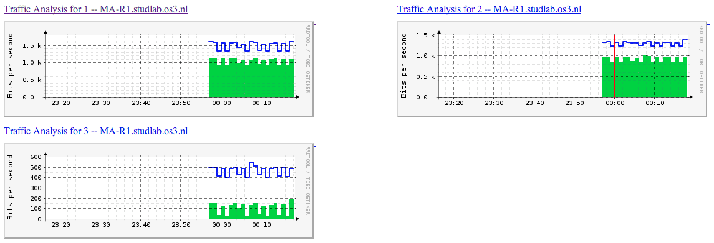

Lab 3: COS and DSCP
===================

Preparation
-----------

Unfortunately I had to work alone on this task because I was on a business trip and missed that week.

I found a 2950 somewhere in a corner which wasn't in use yet so I put that one in my rack (it's on top of `alpha.studalb.os3.nl`).

Task 1: Connection to the switch
--------------------------------

**1. Connect to the serial console of the switch using minicom from one of the groups servers.**

Done, it's connected to mine.

**2. Assign a private IP address to the switch for its management.**

I used the 10.77.65.0/24 range (based on the decimal ASCII values of my initials):

 - switch: 10.77.65.200
 - alpha: 10.77.65.10
 - warsaw: 10.77.65.11
 - helsinki: 10.77.65.12

**3. Every group member should connect his/her server to the switch and configure the appropriate IP addresses. Verify connectivity to each other.**

We can all ping to eachother:

    mike@alpha:~$ ping -c 3 10.77.65.11
	PING 10.77.65.11 (10.77.65.11) 56(84) bytes of data.
	64 bytes from 10.77.65.11: icmp_req=1 ttl=64 time=0.169 ms
	64 bytes from 10.77.65.11: icmp_req=2 ttl=64 time=0.172 ms
	64 bytes from 10.77.65.11: icmp_req=3 ttl=64 time=0.210 ms

	--- 10.77.65.11 ping statistics ---
	3 packets transmitted, 3 received, 0% packet loss, time 1998ms
	rtt min/avg/max/mdev = 0.169/0.183/0.210/0.024 ms
	
	appelman@HelsinkI:~$ ping -c 3 10.77.65.12
	PING 10.77.65.12 (10.77.65.12) 56(84) bytes of data.
	64 bytes from 10.77.65.12: icmp_req=1 ttl=64 time=0.061 ms
	64 bytes from 10.77.65.12: icmp_req=2 ttl=64 time=0.024 ms
	64 bytes from 10.77.65.12: icmp_req=3 ttl=64 time=0.023 ms

	--- 10.77.65.12 ping statistics ---
	3 packets transmitted, 3 received, 0% packet loss, time 1998ms
	rtt min/avg/max/mdev = 0.023/0.036/0.061/0.017 ms
	
	mike@warsaw:~$ ping -c 3 10.77.65.10
	PING 10.77.65.10 (10.77.65.10) 56(84) bytes of data.
	64 bytes from 10.77.65.10: icmp_req=1 ttl=64 time=0.138 ms
	64 bytes from 10.77.65.10: icmp_req=2 ttl=64 time=0.142 ms
	64 bytes from 10.77.65.10: icmp_req=3 ttl=64 time=0.177 ms

	--- 10.77.65.10 ping statistics ---
	3 packets transmitted, 3 received, 0% packet loss, time 2000ms
	rtt min/avg/max/mdev = 0.138/0.152/0.177/0.020 ms

**4. Create user accounts for each group member and set password for SSH and console login. Disable Telnet, HTTP and HTTPS connections if possible.**

    MA-R1(config)#ntp server 10.77.65.10
	MA-R1(config)#service password-encryption
	MA-R1(config)#username mike privilege 15 password ...
	MA-R1(config)#username rawi privilege 15 password ...
	MA-R1(config)#username wouter privilege 15 password ...
	MA-R1(config)#enable password ...
	MA-R1(config)#aaa new-model
	MA-R1(config)#aaa authentication login default local
	MA-R1(config)#aaa authorization exec default local
	MA-R1(config)#aaa authorization network default local
	MA-R1(config)#ip domain-name studlab.os3.nl
	MA-R1(config)#crypto key generate rsa modulus 1024
	MA-R1(config)#no ip http server
	MA-R1(config)#line console 0
	MA-R1(config-line)#password ...
	MA-R1(config-line)#exit
	MA-R1(config)#line vty 0 15
	MA-R1(config-line)#transport input ssh
	MA-R1(config-line)#transport output none
	MA-R1(config-line)#password ...

**5. Set up TFTP server for configs.**

Done:

    # apt-get install tftpd-hpa
	# cat /etc/default/tftpd-hpa 
	# /etc/default/tftpd-hpa

	TFTP_USERNAME="tftp"
	TFTP_DIRECTORY="/var/tftpboot"
	TFTP_ADDRESS="0.0.0.0:69"
	TFTP_OPTIONS="--secure --create"
	
And that works from the switch:

    MA-R1#copy running-config tftp:
	Address or name of remote host []? 10.77.65.10
	Destination filename [ma-r1-confg]? 
	!!
	1931 bytes copied in 3.152 secs (613 bytes/sec)

Task 2: Monitoring
------------------

**1. Enable logging of events to an external server.**

First I have to enable receiving logs from other hosts on my server:

	# cd /etc/rsyslog.d/
	# vi 40-cisco.conf
	# cat 40-cisco.conf 
	:fromhost-ip, isequal, "10.77.65.200" /var/log/cisco.log
	& ~
	# /etc/init.d/rsyslog restart
	Stopping enhanced syslogd: rsyslogd.
	Starting enhanced syslogd: rsyslogd.
	# cat ../syslog.conf
	...
	 # provides UDP syslog reception
	 $ModLoad imudp
	 $UDPServerRun 514

	 # provides TCP syslog reception
	 $ModLoad imtcp
	 $InputTCPServerRun 514
	...

After that I could enable it on my switch:

	MA-R1(config)#log 10.77.65.10 
	MA-R1(config)#log source-interface vlan 1
	MA-R1(config)#log trap informational 

**2. Monitor your switch so that its statistics can be viewed online. This requires to poll via SNMP.**
	
I first enabled SNMP monitoring on the switch:

    MA-R1(config)#snmp-server community ... rw 
    MA-R1(config)#snmp-server enable informs

The I tried setting up Cacti and also Nagios for switches but this turned out to be a hell of a pain... I settled for good old MRTG RRD, which I customized to have hourly graphs instead of daily ones (yes, completely replacing them...):

The graphs can be found [on my server](http://alpha.studlab.os3.nl/cgi-bin/mrtg-rrd.cgi/), without any credentials.

**3. Monitor also your servers.**

I did manage to configured Nagios on my server. It's [reachable from anywhere](http://alpha.studlab.os3.nl/nagios3/) with username `nagiosadmin` and the same password as the switch' console.

After that I installed the NRPE server on all three servers and added them to the Nagios config:

    root@alpha:/etc/nagios3/conf.d# cat helsinki.cfg 
	define host{
	        use             generic-host
	        host_name       helsinki
	        alias           helsinki
	        address         10.77.65.12
	}

	define service{
	        use                     generic-service
	        host_name               helsinki
	        service_description     Current Load
	        check_command           check_nrpe_1arg!check_load
	}
	define service{
	        use                     generic-service
	        host_name               helsinki
	        service_description     Current Users
	        check_command           check_nrpe_1arg!check_users
	}
	define service{
	        use                     generic-service
	        host_name               helsinki
	        service_description     Total Processes
	        check_command           check_nrpe_1arg!check_total_procs
	}

Now I can monitor all servers in the subnet:

**4. Start a webserver on one of the groups server and make sure it can be accessed from within OS3. Monitoring must be live (at the time I will correct the exercises)!**

[Done](http://alpha.studlab.os3.nl/nagios3/) and [done](http://alpha.studlab.os3.nl/cgi-bin/mrtg-rrd.cgi/).

Task 3: Data transfer
---------------------

**1. Using iperf or another data transfer application of your choice to transfer data between pair of nodes. Tune the data transfer to achieve maximum throughput.**

I ran a TCP stream for 60 seconds to one of the hosts while trying to change the MSS and TCP window size, but that didn't really work. I always got the same result:

    root@alpha:/var/www# iperf -c 10.77.65.12 -t 60 -m -w 2M
	------------------------------------------------------------
	Client connecting to 10.77.65.12, TCP port 5001
	TCP window size:   256 KByte (WARNING: requested 2.00 MByte)
	------------------------------------------------------------
	[  3] local 10.77.65.10 port 51869 connected with 10.77.65.12 port 5001
	[ ID] Interval       Transfer     Bandwidth
	[  3]  0.0-60.0 sec    674 MBytes  94.2 Mbits/sec
	[  3] MSS size 1448 bytes (MTU 1500 bytes, ethernet)

And then I ran a UDP test to another server:

    root@alpha:/var/www# iperf -c 10.77.65.11 -u -t 60 -b 100M
	------------------------------------------------------------
	Client connecting to 10.77.65.11, UDP port 5001
	Sending 1470 byte datagrams
	UDP buffer size:   110 KByte (default)
	------------------------------------------------------------
	[  3] local 10.77.65.10 port 48705 connected with 10.77.65.11 port 5001
	[ ID] Interval       Transfer     Bandwidth
	[  3]  0.0-60.0 sec    685 MBytes  95.7 Mbits/sec
	[  3] Sent 488343 datagrams
	[  3] Server Report:
	[  3]  0.0-60.0 sec    685 MBytes  95.7 Mbits/sec  0.358 ms    0/488342 (0%)
	[  3]  0.0-60.0 sec  1 datagrams received out-of-order

The out-of-order datagram might be because of MAC learning at the beginning of the stream.

**2. Define a scenario where the data transfers interfere with each other.**

I will run two UDP streams from one server and one other UDP stream from another. The first two UDP streams will be 40Mbps and another UDP stream which should be 50 Mbps, but because the line will congest because of that, they will need to share the available bandwitdh.

I'll start two `iperf` streams, one on my server and one on another:

    iperf -c 10.77.65.12 -u -t 120 -b 40M -P 2 
    iperf -c 10.77.65.12 -u -t 120 -b 50M

And then we'll see the performance of the streams on the switch itself, confirming the settings:

    MA-R1#sh controllers utilization 
	Port       Receive Utilization  Transmit Utilization
	Fa0/1              84                   0
	Fa0/2              52                   0
	Fa0/3              0                    100
	...

So obviously the line towards the third server has become congested. Also seen using the output from the `iperf` streams on the server:

    [  3]  0.0-120.2 sec   530 MBytes  37.0 Mbits/sec  14.141 ms 132602/510638 (26%)
	[  3]  0.0-120.2 sec  1 datagrams received out-of-order
	[  4]  0.0-120.0 sec   422 MBytes  29.5 Mbits/sec   0.004 ms 107401/408163 (26%)
	[  4]  0.0-120.0 sec  1 datagrams received out-of-order
	[  5]  0.0-120.0 sec   420 MBytes  29.4 Mbits/sec   0.005 ms 108577/408163 (27%)
	[  5]  0.0-120.0 sec  1 datagrams received out-of-order

See also the following graph:

Task 4: CoS configuration
-------------------------

**1. Configure CoS marking the switchports and try to achieve desired behaviour by manipulating the mapping between class of service and the available output queues.**

Usinf CoS we will try to get the first stream of 37Mbps up to the configured 50Mbps, while deprecating the two other UDP streams.

First we will configure an ACL to match this flow:

    MA-R1(config)#ip access-list extended COS 
	MA-R1(config-ext-nacl)#permit udp host 10.77.65.11 host 10.77.65.12

Then we need to enable and configure QoS.

This means we need to define a mapping between CoS and DSCP, of which this is one of the most common:

	MA-R1(config)#mls qos map cos-dscp 0 8 16 24 34 46 48 56
	MA-R1(config)#do sh mls qos map  

	   Dscp-cos map:
	       dscp:   0  8 10 16 18 24 26 32 34 40 46 48 56 
	     -----------------------------------------------
	        cos:   0  1  1  2  2  3  3  4  4  5  5  6  7 

	   Cos-dscp map:
	        cos:   0  1  2  3  4  5  6  7 
	     --------------------------------
	       dscp:   0  8 16 24 34 46 48 56 

Then we need to map the ACL to a Class Map:

    MA-R1(config)#class-map match-all FLOW1
	MA-R1(config-cmap)#match access-group name COS

After that we will give it a nice DSCP value:

    MA-R1(config)#policy-map FLOW1 
	MA-R1(config-pmap)#class FLOW1
	MA-R1(config-pmap-c)#set ip dscp ef

And then we need to apply it to the interface:

    MA-R1(config)#int fa0/2
    MA-R1(config-if)#service-policy input FLOW1

And now the flow has been prioritized:

    [ ID] Interval       Transfer     Bandwidth        Jitter   Lost/Total Datagrams
	[  3]  0.0-120.1 sec   328 MBytes  22.9 Mbits/sec   0.387 ms 173933/408164 (43%)
	[  3]  0.0-120.1 sec  1 datagrams received out-of-order
	[  4]  0.0-120.1 sec   327 MBytes  22.9 Mbits/sec   0.391 ms 174586/408163 (43%)
	[  4]  0.0-120.1 sec  1 datagrams received out-of-order
	[SUM]  0.0-120.1 sec   656 MBytes  45.8 Mbits/sec
	[  5]  0.0-120.0 sec   716 MBytes  50.0 Mbits/sec   0.021 ms    0/510638 (0%)
	[  5]  0.0-120.0 sec  1 datagrams received out-of-order

The 50Mbps has suffered no packet loss while the others did.

**2. Decide when strict scheduling or WRR are appropriate.**

In the previous example WRR was disabled:

    MA-R1#show wrr-queue bandwidth 
	wrr-queue bandwidth is disabled

To enable it we need to [configure bandwidth priorities](http://www.cisco.com/en/US/docs/switches/lan/catalyst2950/software/release/12.1_22_ea2/configuration/guide/swqos.html#wp1034081) (here we configure the fourth queue as the expedited queue):

    MA-R1(config)#wrr-queue bandwidth 5 25 70 0
    MA-R1(config)#do sh wrr-qu band
	WRR Queue  :   1   2   3   4 

	Bandwidth  :   5  25  70   0 

This will yield a bit different results in our setup. Causing some packet loss in the 50M stream due to the coarse approach of the algorithm:

    [  6]  0.0-120.0 sec   710 MBytes  49.6 Mbits/sec   0.173 ms 4256/510636 (0.83%)
	[  6]  0.0-120.0 sec  1 datagrams received out-of-order
	[  3]  0.0-120.0 sec   330 MBytes  23.1 Mbits/sec   0.004 ms 172583/408163 (42%)
	[  3]  0.0-120.0 sec  1 datagrams received out-of-order
	[  4]  0.0-120.0 sec   329 MBytes  23.0 Mbits/sec   0.004 ms 173137/408163 (42%)
	[  4]  0.0-120.0 sec  1 datagrams received out-of-order
	[SUM]  0.0-120.0 sec   660 MBytes  46.1 Mbits/sec

WRR is a valuable alternative for a network in which not all types of flows are known or the queueing prioritisation can be approximate. When some flows need to be explicitly preferred above others, strict scheduling is recommended.

Task 5: DSCP
------------

**1. Packet marking. Mark your outgoing packets using iptables. Show that the packets are marked (with Wireshark).**

Now instead of the policy map applied to class, we will mark the packets going out of one of the servers...

    # iptables -t mangle -N an-dscp
    # iptables -t mangle -A POSTROUTING -j an-dscp
    # iptables -t mangle -A an-dscp -s 10.77.65.11 -d 10.77.65.12 -j DSCP --set-dscp-class ef

... and let the switch trust those markings:

    MA-R1(config)#int fa0/2
	MA-R1(config-if)#mls qos trust dscp

This will show in the TCP dump when doing a ping from `warsaw` to `helsinki` as well:

    appelman@HelsinkI:~$ sudo tshark -i eth1 -f icmp -Tfields -e ip.src -e ip.dst -e ip.dsfield.dscp
	10.77.65.11    10.77.65.12    0x2e
	10.77.65.12    10.77.65.11    0x2e

**2. Show how DSCP marking improves traffic performance.**

Now we can try the same test streams again to see if works.

    [ ID] Interval       Transfer     Bandwidth        Jitter   Lost/Total Datagrams
	[  3]  0.0-120.0 sec   716 MBytes  50.0 Mbits/sec   0.103 ms    0/510638 (0%)
	[  3]  0.0-120.0 sec  1 datagrams received out-of-order
	[  4]  0.0-120.0 sec   328 MBytes  22.9 Mbits/sec   0.005 ms 174068/408163 (43%)
	[  4]  0.0-120.0 sec  1 datagrams received out-of-order
	[  5]  0.0-120.0 sec   327 MBytes  22.9 Mbits/sec   0.004 ms 174742/408163 (43%)
	[  5]  0.0-120.0 sec  1 datagrams received out-of-order
	
And it apparently does!

This is exaclty the same result as the CoS marking test, which is explained by the fact that the CoS and DSCP markings are directly mapped to eachother. The only difference is how the switch knows about placing the flow in the EF queue.

Submission
----------

 * See for the switch config the [lab3-switch-config](lab3-switch-config) file.
 * This document contains all the requested output (scenario w/ results, etc.)
 * The link to the monitoring sites are also available, but due to RRA averaging the real transfer speeds might be lost in time. Which is why I also included the following graph with the first peak being a transfer without any queueing and the second with DSCP marking:

References
----------

 * http://openmaniak.com/iperf.php
 * http://www.dslreports.com/faq/13324
 * http://www.cisco.com/en/US/docs/switches/lan/catalyst2950/software/release/12.1_14_ea1/configuration/guide/swqos.html

