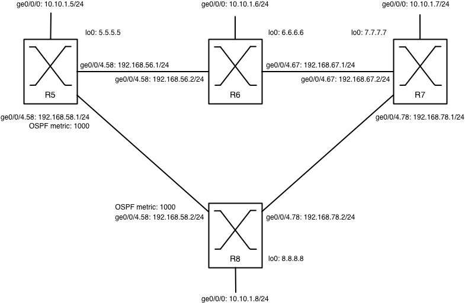

Lab 5: MPLS Treasure Hunt
==========================

**What are the IP addressing details of this topology?**

**Which IGP is used?**

OSPF.

**Describe in detail its configuration and its functioning. Use show commands to explain the set-up.**

When we look at the config we see one large backbone area, with no stub areas. Which is pretty similar on all routers:

    ospf {
        area 0.0.0.0 {
            interface ge-0/0/4.56 {
                interface-type p2p;
                hello-interval 1;
                dead-interval 4;
            }
            interface ge-0/0/4.67 {
                interface-type p2p;
                hello-interval 1;
                dead-interval 4;
            }
            interface lo0.0;
        }
    }

Except for R8, which has an extra policy and also a metric configured on neighbour R5. 

    export flikkerinospf;
    area 0.0.0.0 {
        interface ge-0/0/4.58 {
            interface-type p2p;
            metric 1000;
            hello-interval 1;
            dead-interval 4;
        }
    }

The routes in R5 display this as well:

    student@srx5> show ospf route 
	Topology default Route Table:

	Prefix             Path  Route      NH       Metric NextHop       Nexthop      
	                   Type  Type       Type            Interface     Address/LSP
	6.6.6.6            Intra Router     IP            1 ge-0/0/4.56   192.168.56.2
	7.7.7.7            Intra Router     IP            2 ge-0/0/4.56   192.168.56.2
	8.8.8.8            Intra AS BR      IP            3 ge-0/0/4.56   192.168.56.2
	5.5.5.5/32         Intra Network    IP            0 lo0.0
	6.6.6.6/32         Intra Network    IP            1 ge-0/0/4.56   192.168.56.2
	7.7.7.7/32         Intra Network    IP            2 ge-0/0/4.56   192.168.56.2
	8.8.8.8/32         Intra Network    IP            3 ge-0/0/4.56   192.168.56.2
	145.125.0.0/16     Ext2  Network    IP            0 ge-0/0/4.56   192.168.56.2
	192.168.56.0/24    Intra Network    IP            1 ge-0/0/4.56
	192.168.58.0/24    Intra Network    IP         1000 ge-0/0/4.58
	192.168.67.0/24    Intra Network    IP            2 ge-0/0/4.56   192.168.56.2
	192.168.78.0/24    Intra Network    IP            3 ge-0/0/4.56   192.168.56.2

Here you can also see the external route 145.125.0.0/16 which is propagated from R8, which makes it an AS Boundary Router:

    student@srx8> show ospf overview 
	Instance: master
	  Router ID: 8.8.8.8
	  Route table index: 0
	  AS boundary router
	  LSA refresh time: 50 minutes
	  Area: 0.0.0.0
	    Stub type: Not Stub
	    Authentication Type: None
	    Area border routers: 0, AS boundary routers: 0
	    Neighbors
	      Up (in full state): 2
	  Topology: default (ID 0)
	    Prefix export count: 1
	    Full SPF runs: 4
	    SPF delay: 0.200000 sec, SPF holddown: 5 sec, SPF rapid runs: 3
	    Backup SPF: Not Needed

**Question 2: Which routes are present on the routers (which routing table)?**

On R8 we see the routes displayed below. There are three "routing tables". The first one, inet.0, is the normal routing table that does the normal layer three forwarding decisions. The third one, mpls.0, is the MPLS "routing" (or forwarding) table. The second one, inet.3, is a special one. It contains host routes that are installed when an LSP is configured and it is typically used by BGP to resolve the destination address of the LSP. With the `traffic-engineering bgp-igp` statement, which is used on router rx5 (later more on that), these host routes are installed in the inet.0 table and can also be used by IGP's.

    student@srx8> show route					
	inet.0: 15 destinations, 15 routes (15 active, 0 holddown, 0 hidden)
	+ = Active Route, - = Last Active, * = Both

	5.5.5.5/32         *[OSPF/10] 01:21:14, metric 3
	                    > to 192.168.78.1 via ge-0/0/4.78
	6.6.6.6/32         *[OSPF/10] 01:21:14, metric 2
	                    > to 192.168.78.1 via ge-0/0/4.78
	7.7.7.7/32         *[OSPF/10] 01:21:14, metric 1
	                    > to 192.168.78.1 via ge-0/0/4.78
	8.8.8.8/32         *[Direct/0] 01:21:24
	                    > via lo0.0
	10.10.1.0/24       *[Direct/0] 01:21:44
	                    > via ge-0/0/0.0
	10.10.1.8/32       *[Local/0] 01:21:58
	                      Local via ge-0/0/0.0
	10.10.10.0/24      *[Static/5] 01:21:44
	                    > to 10.10.1.254 via ge-0/0/0.0
	145.125.0.0/16     *[Static/5] 01:21:34
	                      Discard
	192.168.56.0/24    *[OSPF/10] 01:21:14, metric 3
	                    > to 192.168.78.1 via ge-0/0/4.78
	192.168.58.0/24    *[Direct/0] 01:21:24
	                    > via ge-0/0/4.58
	192.168.58.2/32    *[Local/0] 01:21:24
	                      Local via ge-0/0/4.58
	192.168.67.0/24    *[OSPF/10] 01:21:14, metric 2
	                    > to 192.168.78.1 via ge-0/0/4.78
	192.168.78.0/24    *[Direct/0] 01:21:24
	                    > via ge-0/0/4.78
	192.168.78.2/32    *[Local/0] 01:21:24
	                      Local via ge-0/0/4.78
	224.0.0.5/32       *[OSPF/10] 01:21:34, metric 1
	                      MultiRecv

	inet.3: 3 destinations, 3 routes (3 active, 0 holddown, 0 hidden)
	+ = Active Route, - = Last Active, * = Both

	5.5.5.5/32         *[LDP/9] 01:21:10, metric 1
	                    > to 192.168.78.1 via ge-0/0/4.78, Push 299792
	6.6.6.6/32         *[LDP/9] 01:21:10, metric 1
	                    > to 192.168.78.1 via ge-0/0/4.78, Push 299776
	7.7.7.7/32         *[LDP/9] 01:21:10, metric 1
	                    > to 192.168.78.1 via ge-0/0/4.78

	mpls.0: 7 destinations, 7 routes (7 active, 0 holddown, 0 hidden)
	+ = Active Route, - = Last Active, * = Both

	0                  *[MPLS/0] 01:21:34, metric 1
	                      Receive
	1                  *[MPLS/0] 01:21:34, metric 1
	                      Receive
	2                  *[MPLS/0] 01:21:34, metric 1
	                      Receive
	299776             *[LDP/9] 01:21:10, metric 1
	                    > to 192.168.78.1 via ge-0/0/4.78, Pop
	299776(S=0)        *[LDP/9] 01:21:10, metric 1
	                    > to 192.168.78.1 via ge-0/0/4.78, Pop
	299792             *[LDP/9] 01:21:10, metric 1
	                    > to 192.168.78.1 via ge-0/0/4.78, Swap 299776
	299808             *[LDP/9] 01:21:10, metric 1
	                    > to 192.168.78.1 via ge-0/0/4.78, Swap 299792
	

Which are pretty much expected when you look at the topology. Except for the explicit discard which is configured below:

    routing-options {
        static {
            route 10.10.10.0/24 {
                next-hop 10.10.1.254;
                no-readvertise;
            }
            route 145.125.0.0/16 discard;
        }
        router-id 8.8.8.8;
    }

Thanks to the earlier mentioned policy `flikkerinospf` this is redistributed across the whole area:

    policy-options {
	    policy-statement flikkerinospf {
	        term 1 {
	            from protocol static;
	            then accept;
	        }
	    }
	}

Causing all traffic for that network to be routed to R8 and then discarded.

With regards to the LDP configuration and connectivity, we can see on R8:

    inet.3: 3 destinations, 3 routes (3 active, 0 holddown, 0 hidden)
    + = Active Route, - = Last Active, * = Both
    
    5.5.5.5/32         *[LDP/9] 00:49:47, metric 1
                        > to 192.168.78.1 via ge-0/0/4.78, Push 299792

This means that R8 has heard from R7 that to reach R5 (5.5.5.5) it can use the 299792 label and R7 will forward to R5. Although this is a longer path (R8-R7-R6-R5), the path checks out because the IGP (OSPF) considers the R5-R8 link longer because it has a metric of 1000.

When we take a look at R7:

     inet.3: 3 destinations, 3 routes (3 active, 0 holddown, 0 hidden)
     + = Active Route, - = Last Active, * = Both
     
     5.5.5.5/32         *[LDP/9] 01:06:32, metric 1
                         > to 192.168.67.1 via ge-0/0/4.67, Push 299776

We see it will reach R5 by forwarding it to R6 and push label 299776. Which will be useful to R8 because we also see on R7:

    mpls.0: 10 destinations, 10 routes (10 active, 0 holddown, 0 hidden)
    + = Active Route, - = Last Active, * = Both
    
    ...
    299792             *[LDP/9] 01:06:32, metric 1
                        > to 192.168.67.1 via ge-0/0/4.67, Swap 299776

Here it says that R7 will swap the incoming 299792 label with the 299776 label.

With regards to the mpls.0 table of router rx8 that we saw earlier, we see the installed labels and the destinations and actions that are attached to them (e.g. pop, swap).

**Question 3: What are the MPLS labels used?**

The following labels are present in the LDP databases of all the routers:

    student@srx5> show ldp database
	Input label database, 5.5.5.5:0--6.6.6.6:0
	  Label     Prefix
	 299776     5.5.5.5/32
	      3     6.6.6.6/32
	 299792     7.7.7.7/32
	 299808     8.8.8.8/32

	Output label database, 5.5.5.5:0--6.6.6.6:0
	  Label     Prefix
	      3     5.5.5.5/32
	 299776     6.6.6.6/32
	 299792     7.7.7.7/32
	 299808     8.8.8.8/32

	Input label database, 5.5.5.5:0--8.8.8.8:0
	  Label     Prefix
	 299808     5.5.5.5/32
	 299792     6.6.6.6/32
	 299776     7.7.7.7/32
	      3     8.8.8.8/32

	Output label database, 5.5.5.5:0--8.8.8.8:0
	  Label     Prefix
	      3     5.5.5.5/32
	 299776     6.6.6.6/32
	 299792     7.7.7.7/32
	 299808     8.8.8.8/32

	student@srx6> show ldp database
	Input label database, 6.6.6.6:0--5.5.5.5:0
	  Label     Prefix
	      3     5.5.5.5/32
	 299776     6.6.6.6/32
	 299792     7.7.7.7/32
	 299808     8.8.8.8/32

	Output label database, 6.6.6.6:0--5.5.5.5:0
	  Label     Prefix
	 299776     5.5.5.5/32
	      3     6.6.6.6/32
	 299792     7.7.7.7/32
	 299808     8.8.8.8/32

	Input label database, 6.6.6.6:0--7.7.7.7:0
	  Label     Prefix
	 299792     5.5.5.5/32
	 299776     6.6.6.6/32
	      3     7.7.7.7/32
	 299808     8.8.8.8/32

	Output label database, 6.6.6.6:0--7.7.7.7:0
	  Label     Prefix
	 299776     5.5.5.5/32
	      3     6.6.6.6/32
	 299792     7.7.7.7/32
	 299808     8.8.8.8/32

	student@srx7> show ldp database
	Input label database, 7.7.7.7:0--6.6.6.6:0
	  Label     Prefix
	 299776     5.5.5.5/32
	      3     6.6.6.6/32
	 299792     7.7.7.7/32
	 299808     8.8.8.8/32

	Output label database, 7.7.7.7:0--6.6.6.6:0
	  Label     Prefix
	 299792     5.5.5.5/32
	 299776     6.6.6.6/32
	      3     7.7.7.7/32
	 299808     8.8.8.8/32

	Input label database, 7.7.7.7:0--8.8.8.8:0
	  Label     Prefix
	 299808     5.5.5.5/32
	 299792     6.6.6.6/32
	 299776     7.7.7.7/32
	      3     8.8.8.8/32

	Output label database, 7.7.7.7:0--8.8.8.8:0
	  Label     Prefix
	 299792     5.5.5.5/32
	 299776     6.6.6.6/32
	      3     7.7.7.7/32
	 299808     8.8.8.8/32

	student@srx8> show ldp database
	Input label database, 8.8.8.8:0--5.5.5.5:0
	  Label     Prefix
	      3     5.5.5.5/32
	 299776     6.6.6.6/32
	 299792     7.7.7.7/32
	 299808     8.8.8.8/32

	Output label database, 8.8.8.8:0--5.5.5.5:0
	  Label     Prefix
	 299808     5.5.5.5/32
	 299792     6.6.6.6/32
	 299776     7.7.7.7/32
	      3     8.8.8.8/32

	Input label database, 8.8.8.8:0--7.7.7.7:0
	  Label     Prefix
	 299792     5.5.5.5/32
	 299776     6.6.6.6/32
	      3     7.7.7.7/32
	 299808     8.8.8.8/32

	Output label database, 8.8.8.8:0--7.7.7.7:0
	  Label     Prefix
	 299808     5.5.5.5/32
	 299792     6.6.6.6/32
	 299776     7.7.7.7/32
	      3     8.8.8.8/32

**Which LSPs are configured between the routers? Explain the labels used by each LSP.**

There is only one LSP configured in the whole setup and that is the LSP `toR8`. This LSP has an ingress at R5 and an egress at R8, with R6 and R7 acting as LSRs. Label 299824 is used on routers rx6 and rx7 to recognize traffic for LSP `toR8`. Router rx7 uses label 3 as its outgoing label. The label `3` is the *Explicit NULL* label which will cause R7 to already pop the label for R8 so it can start processing the packet immediately.

	student@srx5> show mpls lsp
	Ingress LSP: 1 sessions
	To              From            State Rt P     ActivePath       LSPname
	8.8.8.8         5.5.5.5         Up     0 *                      toR8
	Total 1 displayed, Up 1, Down 0

	student@srx6> show mpls lsp
	Transit LSP: 1 sessions
	To              From            State   Rt Style Labelin Labelout LSPname
	8.8.8.8         5.5.5.5         Up       0  1 FF  299824   299824 toR8
	Total 1 displayed, Up 1, Down 0

	student@srx7> show mpls lsp
	Transit LSP: 1 sessions
	To              From            State   Rt Style Labelin Labelout LSPname
	8.8.8.8         5.5.5.5         Up       0  1 FF  299824        3 toR8
	Total 1 displayed, Up 1, Down 0

	student@srx8> show mpls lsp
	Egress LSP: 1 sessions
	To              From            State   Rt Style Labelin Labelout LSPname
	8.8.8.8         5.5.5.5         Up       0  1 FF       3        - toR8
	Total 1 displayed, Up 1, Down 0

**Question 4: RSVP is also configured, which tunnel is built?**
The RSVP tunnel that is build is the same as the LSP we saw before.

	student@srx5> show rsvp session
	Ingress RSVP: 1 sessions
	To              From            State   Rt Style Labelin Labelout LSPname
	8.8.8.8         5.5.5.5         Up       0  1 FF       -   299824 toR8
	Total 1 displayed, Up 1, Down 0

	student@srx6> show rsvp session
	Transit RSVP: 1 sessions
	To              From            State   Rt Style Labelin Labelout LSPname
	8.8.8.8         5.5.5.5         Up       0  1 FF  299824   299824 toR8
	Total 1 displayed, Up 1, Down 0

	student@srx7> show rsvp session
	Transit RSVP: 1 sessions
	To              From            State   Rt Style Labelin Labelout LSPname
	8.8.8.8         5.5.5.5         Up       0  1 FF  299824        3 toR8
	Total 1 displayed, Up 1, Down 0

	student@srx8> show rsvp session
	Egress RSVP: 1 sessions
	To              From            State   Rt Style Labelin Labelout LSPname
	8.8.8.8         5.5.5.5         Up       0  1 FF       3        - toR8
	Total 1 displayed, Up 1, Down 0

Normally the IP forwarding table is filled with BGP routing information which can also get information from the MPLS routing table:

But in this case, the LSP which has been defined is also configured as an RSVP tunnel because of the `traffic-engineering bgp-igp` statement. This causes the `inet.3` table to be incorporated into the `inet.0` table, allowing for the use of the lower level information from MPLS and RSVP by the upper layer IGP of R5. 

Which finally means that the following route will be installed:

    145.125.0.0/32     *[RSVP/7/1] 01:52:25, metric 3
	                    > to 192.168.56.2 via ge-0/0/4.56, label-switched-path toR8

This process can be found on the [Juniper Tech Publications](http://www.juniper.net/techpubs/en_US/junos9.5/information-products/topic-collections/config-guide-mpls-applications/mpls-configuring-traffic-engineering-for-lsps.html#id-30128) and [this article](http://www.juniper.net/techpubs/software/junos/junos93/swconfig-mpls-apps/mpls-and-routing-tables.html).

**Why is this tunnel preferred above the LSP built by LDP? What do you need to change this preference?**

RSVP has a default administrative distance of 7 which is lower than LDP (which has 9) and OSPF internal (which has 10). You can change that distance yourself to a higher value if you want. See also this [list of AD's](http://switchingandrouting.wordpress.com/2011/07/10/administrative-distance-ad-values-in-cisco-juniper/).

