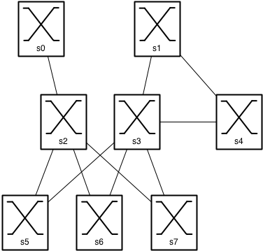

Lab 6: OpenFlow
===============

Installation
------------

Was pretty painless, setup the VM in my VirtualBox host on my Macbook. Configured my public key and installed `tmux` and SSH'ed into it. Test worked:

    *** Creating network
	*** Adding controller
	*** Adding hosts:
	h1 h2 
	*** Adding switches:
	s1 
	*** Adding links:
	(h1, s1) (h2, s1) 
	*** Configuring hosts
	h1 h2 
	*** Starting controller
	*** Starting 1 switches
	s1 
	*** Starting CLI:
	mininet> nodes
	available nodes are: 
	h1 h2 c0 s1
	mininet> h1 ifconfig
	h1-eth0   Link encap:Ethernet  HWaddr 82:1a:44:8f:26:ed  
	          inet addr:10.0.0.1  Bcast:10.255.255.255  Mask:255.0.0.0
	          inet6 addr: fe80::801a:44ff:fe8f:26ed/64 Scope:Link
	          UP BROADCAST RUNNING MULTICAST  MTU:1500  Metric:1
	          RX packets:11 errors:0 dropped:0 overruns:0 frame:0
	          TX packets:6 errors:0 dropped:0 overruns:0 carrier:0
	          collisions:0 txqueuelen:1000 
	          RX bytes:846 (846.0 B)  TX bytes:468 (468.0 B)

	lo        Link encap:Local Loopback  
	          inet addr:127.0.0.1  Mask:255.0.0.0
	          inet6 addr: ::1/128 Scope:Host
	          UP LOOPBACK RUNNING  MTU:16436  Metric:1
	          RX packets:0 errors:0 dropped:0 overruns:0 frame:0
	          TX packets:0 errors:0 dropped:0 overruns:0 carrier:0
	          collisions:0 txqueuelen:0 
	          RX bytes:0 (0.0 B)  TX bytes:0 (0.0 B)
    mininet> exit
    *** Stopping 2 hosts
    h1 h2 
    *** Stopping 1 switches
    s1 ...
    *** Stopping 1 controllers
    c0 
    *** Done
    completed in 60.914 seconds

Task 1: Starting up a small Openflow network
--------------------------------------------

As requested:

    mininet@mininet-vm:~/mininet$ sudo mn --topo single,3 --mac --switch ovsk --controller remote
	*** Creating network
	*** Adding controller
	Unable to contact the remote controller at 127.0.0.1:6633
	*** Adding hosts:
	h1 h2 h3 
	*** Adding switches:
	s1 
	*** Adding links:
	(h1, s1) (h2, s1) (h3, s1) 
	*** Configuring hosts
	h1 h2 h3 
	*** Starting controller
	*** Starting 1 switches
	s1 
	*** Starting CLI:
	mininet> h1 ping -c3 h2
	PING 10.0.0.2 (10.0.0.2) 56(84) bytes of data.
	From 10.0.0.1 icmp_seq=1 Destination Host Unreachable
	From 10.0.0.1 icmp_seq=2 Destination Host Unreachable
	From 10.0.0.1 icmp_seq=3 Destination Host Unreachable

	--- 10.0.0.2 ping statistics ---
	3 packets transmitted, 0 received, +3 errors, 100% packet loss, time 2016ms
	pipe 3

But this won't work as there are no flows installed:

    $ dpctl dump-flows tcp:127.0.0.1:6634
	stats_reply (xid=0x42e1ef75): flags=none type=1(flow)

So let's set them up:

    $ dpctl add-flow tcp:127.0.0.1:6634 in_port=1,actions=output:2
	$ dpctl add-flow tcp:127.0.0.1:6634 in_port=2,actions=output:1
	$ dpctl dump-flows tcp:127.0.0.1:6634
	stats_reply (xid=0xffb52f9e): flags=none type=1(flow)
	  cookie=0, duration_sec=33s, duration_nsec=631000000s, table_id=0, priority=32768, n_packets=0, n_bytes=0, idle_timeout=60,hard_timeout=0,in_port=1,actions=output:2
	  cookie=0, duration_sec=27s, duration_nsec=800000000s, table_id=0, priority=32768, n_packets=0, n_bytes=0, idle_timeout=60,hard_timeout=0,in_port=2,actions=output:1

And now I can ping again (as long as I do it within the 60 seconds timeout of the flow):

    mininet> h1 ping -c3 h2
	PING 10.0.0.2 (10.0.0.2) 56(84) bytes of data.
	64 bytes from 10.0.0.2: icmp_req=1 ttl=64 time=0.445 ms
	64 bytes from 10.0.0.2: icmp_req=2 ttl=64 time=0.288 ms
	64 bytes from 10.0.0.2: icmp_req=3 ttl=64 time=0.292 ms

	--- 10.0.0.2 ping statistics ---
	3 packets transmitted, 3 received, 0% packet loss, time 2009ms
	rtt min/avg/max/mdev = 0.288/0.341/0.445/0.076 ms

Task 2: Setting up a controller
-------------------------------

This worked.

Task 3: Communication switch-controller
---------------------------------------

There are two kind of packets going to and fro the controller during the Hub kind of functionality, the *Packet In* event which encapsulates the incoming frame and sends it to the controller and the *Packet Out* event which will give the switch the appropriate action to act on the frame.

*Packet In*:

    Frame 1: 182 bytes on wire (1456 bits), 182 bytes captured (1456 bits) on interface 0
	Ethernet II, Src: 00:00:00_00:00:00 (00:00:00:00:00:00), Dst: 00:00:00_00:00:00 (00:00:00:00:00:00)
	Internet Protocol Version 4, Src: 127.0.0.1 (127.0.0.1), Dst: 127.0.0.1 (127.0.0.1)
	Transmission Control Protocol, Src Port: 34432 (34432), Dst Port: 6633 (6633), Seq: 1, Ack: 1, Len: 116
	OpenFlow Protocol
	    Header
	        Version: 0x01
	        Type: Packet In (AM) (10)
	        Length: 116
	        Transaction ID: 0
	    Packet In
	        Buffer ID: 366
	        Frame Total Length: 98
	        Frame Recv Port: 1
	        Reason Sent: No matching flow (0)
	        Frame Data: 000000000002000000000001080045000054000040004001...
	            Ethernet II, Src: 00:00:00_00:00:01 (00:00:00:00:00:01), Dst: 00:00:00_00:00:02 (00:00:00:00:00:02)
	            Internet Protocol Version 4, Src: 10.0.0.1 (10.0.0.1), Dst: 10.0.0.2 (10.0.0.2)
	                Version: 4
	                Header length: 20 bytes
	                Differentiated Services Field: 0x00 (DSCP 0x00: Default; ECN: 0x00: Not-ECT (Not ECN-Capable Transport))
	                Total Length: 84
	                Identification: 0x0000 (0)
	                Flags: 0x02 (Don't Fragment)
	                Fragment offset: 0
	                Time to live: 64
	                Protocol: ICMP (1)
	                Header checksum: 0x26a7 [correct]
	                Source: 10.0.0.1 (10.0.0.1)
	                Destination: 10.0.0.2 (10.0.0.2)
	                [Source GeoIP: Unknown]
	                [Destination GeoIP: Unknown]
	            Internet Control Message Protocol

*Packet Out*:

    Frame 2: 90 bytes on wire (720 bits), 90 bytes captured (720 bits) on interface 0
	Ethernet II, Src: 00:00:00_00:00:00 (00:00:00:00:00:00), Dst: 00:00:00_00:00:00 (00:00:00:00:00:00)
	Internet Protocol Version 4, Src: 127.0.0.1 (127.0.0.1), Dst: 127.0.0.1 (127.0.0.1)
	Transmission Control Protocol, Src Port: 6633 (6633), Dst Port: 34432 (34432), Seq: 1, Ack: 117, Len: 24
	OpenFlow Protocol
	    Header
	        Version: 0x01
	        Type: Packet Out (CSM) (13)
	        Length: 24
	        Transaction ID: 140
	    Packet Out
	        Buffer ID: 366
	        Frame Recv Port: 1
	        Size of action array in bytes: 8
	        Output Action(s)
	            Action
	                Type: Output to switch port (0)
	                Len: 8
	                Output port: All  (all physical ports except input port)
	                Max Bytes to Send: 0
	            # of Actions: 1

During the startup of the switches we can see that they will also exchange some other messages:

 - **Hello** - setup the connection and keep-alive
 - **Feature Request** - from controller to switch
 - **Feature Reply** - from switch to controller
 - **Set Config** - from controller to switch, sets default config
 - **Barrier Request** - from controller to switch, indicating that the switch will need to finish processing all commands up until now before continueing
 - **Barrier Reply** - from switch to controller, indicating that the switch has finished processing all commands up until the *Barrier Request*.

Task 4: MAC learning switch
---------------------------

Did this as well using the following code:

```python
def act_like_switch (self, packet, packet_in):
""" 
Implement switch-like behavior.
"""

# Learn the port for the source MAC
self.mac_to_port[str(packet.src)] = packet_in.in_port

if str(packet.dst) in self.mac_to_port:
  # Send packet out the associated port
  #self.resend_packet(packet_in, self.mac_to_port[str(packet.dst)])

  # Once you have the above working, try pushing a flow entry
  # instead of resending the packet (comment out the above and
  # uncomment and complete the below.)

  log.debug("new flow: match on " + str(packet.dst) + " output to "+ str(self.mac_to_port[str(packet.dst)]))
  # Maybe the log statement should have source/destination/port?

  msg = of.ofp_flow_mod()
  #   
  ## Set fields to match received packet
  msg.match = of.ofp_match.from_packet(packet, packet_in.in_port)
  #   
  #< Set other fields of flow_mod (timeouts? buffer_id?) >
  msg.idle_timeout = 8 
  #   
  #< Add an output action, and send -- similar to resend_packet() >
  msg.actions.append(of.ofp_action_output(port = self.mac_to_port[str(packet.dst)]))
  self.connection.send(msg)

else:
  # Flood the packet out everything but the input port
  # This part looks familiar, right?
  self.resend_packet(packet_in, of.OFPP_ALL)
```

And this apparently works:

    $ dpctl dump-flows tcp:127.0.0.1:6634
	stats_reply (xid=0xd0cb4fbf): flags=none type=1(flow)
	  cookie=0, duration_sec=216s, duration_nsec=881000000s, table_id=0, priority=65535, n_packets=215, n_bytes=21070, idle_timeout=8,hard_timeout=0,icmp,in_port=2,dl_vlan=0xffff,dl_vlan_pcp=0x00,dl_src=00:00:00:00:00:02,dl_dst=00:00:00:00:00:01,nw_src=10.0.0.2,nw_dst=10.0.0.1,nw_tos=0x00,icmp_type=0,icmp_code=0,actions=output:1
	  cookie=0, duration_sec=217s, duration_nsec=841000000s, table_id=0, priority=65535, n_packets=216, n_bytes=21168, idle_timeout=8,hard_timeout=0,icmp,in_port=1,dl_vlan=0xffff,dl_vlan_pcp=0x00,dl_src=00:00:00:00:00:01,dl_dst=00:00:00:00:00:02,nw_src=10.0.0.1,nw_dst=10.0.0.2,nw_tos=0x00,icmp_type=8,icmp_code=0,actions=output:2
	  cookie=0, duration_sec=7s, duration_nsec=629000000s, table_id=0, priority=65535, n_packets=2, n_bytes=84, idle_timeout=8,hard_timeout=0,arp,in_port=2,dl_vlan=0xffff,dl_vlan_pcp=0x00,dl_src=00:00:00:00:00:02,dl_dst=00:00:00:00:00:01,nw_src=10.0.0.2,nw_dst=10.0.0.1,nw_proto=1,actions=output:1
	  cookie=0, duration_sec=6s, duration_nsec=630000000s, table_id=0, priority=65535, n_packets=1, n_bytes=42, idle_timeout=8,hard_timeout=0,arp,in_port=1,dl_vlan=0xffff,dl_vlan_pcp=0x00,dl_src=00:00:00:00:00:01,dl_dst=00:00:00:00:00:02,nw_src=10.0.0.1,nw_dst=10.0.0.2,nw_proto=2,actions=output:2
	
Abve we can see 4 flows, 2 for ICMP and 2 for ARP (which expire once in a while). We can also see the `idle_timeout` here which effectively means a CAM timeout of 8 (idle) seconds.

Task5: Implement a monitoring port
----------------------------------

To do this I simply appended another action to the flow that will be installed in the switch after the first frame is being send to the controller:

        #< Set other fields of flow_mod (timeouts? buffer_id?) >
        msg.idle_timeout = 8 
        #   
        #< Add an output action, and send -- similar to resend_packet() >
    >   msg.actions.append(of.ofp_action_output(port = 3))
        msg.actions.append(of.ofp_action_output(port = self.mac_to_port[str(packet.dst)]))
        self.connection.send(msg)

Now every flow will have two output ports, the legitimate one and the mirror port (port 3):

    $ dpctl dump-flows tcp:127.0.0.1:6634
	stats_reply (xid=0xa159ad97): flags=none type=1(flow)
	  cookie=0, duration_sec=20s, duration_nsec=388000000s, table_id=0, priority=65535, n_packets=18, n_bytes=1764, idle_timeout=8,hard_timeout=0,icmp,in_port=2,dl_vlan=0xffff,dl_vlan_pcp=0x00,dl_src=00:00:00:00:00:02,dl_dst=00:00:00:00:00:01,nw_src=10.0.0.2,nw_dst=10.0.0.1,nw_tos=0x00,icmp_type=0,icmp_code=0,actions=output:3,output:1
	  cookie=0, duration_sec=19s, duration_nsec=391000000s, table_id=0, priority=65535, n_packets=18, n_bytes=1764, idle_timeout=8,hard_timeout=0,icmp,in_port=1,dl_vlan=0xffff,dl_vlan_pcp=0x00,dl_src=00:00:00:00:00:01,dl_dst=00:00:00:00:00:02,nw_src=10.0.0.1,nw_dst=10.0.0.2,nw_tos=0x00,icmp_type=8,icmp_code=0,actions=output:3,output:2

I verified this by `tcpdump`ing on host 3 and pinging between host 1 and 2.

Please see the [lab6-awesome_switch.py](lab6-awesome_switch.py) file for the complete source.

Task 6: Implement Dijkstras algorithm
-------------------------------------

I made my topology like this:



By editing the topo.py file like this:

```python
from mininet.topo import Topo
from mininet.net import Mininet
from mininet.util import dumpNodeConnections
from mininet.log import setLogLevel

class MyTopo(Topo):
    def __init__(self,n=8, **opts):
        Topo.__init__(self, **opts)
        switches = []
        hosts = []
        for i in range(n):
            switches.append(self.addSwitch('s'+str(i)))
        for j in range(n):
            hosts.append(self.addHost('h'+str(j)))
        for k in range(n):
            self.addLink(switches[k], hosts[k])

        # ISLs
        self.addLink(switches[0], switches[2])
        self.addLink(switches[1], switches[3])
        self.addLink(switches[1], switches[4])
        self.addLink(switches[2], switches[5])
        self.addLink(switches[2], switches[6])
        self.addLink(switches[2], switches[7])
        self.addLink(switches[3], switches[4])
        self.addLink(switches[3], switches[5])
        self.addLink(switches[3], switches[6])
        self.addLink(switches[3], switches[7])

# end MyTopo

topos = {'mytopo' : (lambda: MyTopo())}
```

